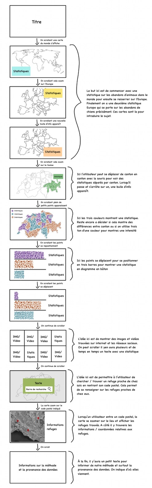

# Projet de visualisation de données sur les animaux abandonnés, précisément les chiens 🐾

Projet de visualisation de données sous forme de site web scrollable (“scrollytelling”).
L’objectif est de sensibiliser au problème des animaux abandonnés, avec un focus progressif sur les chiens.

---

## Contexte — d’où viennent les données ?

Nous combinons deux types de sources :

### 1) Sources statistiques (fiables / institutionnelles)
- **Protection Suisse des Animaux (PSA / STS)** : statistiques issues des refuges affiliés (Suisse).  
  Exemple : la PSA publie des chiffres annuels sur les animaux pris en charge et mentionne notamment l’évolution du nombre de chiens abandonnés/remis.
- **Médias suisses de référence** (pour contextualiser les chiffres PSA) : reprise et explication des données PSA.
- **Contexte global** : estimation de l’OMS citée par des ONG (ordre de grandeur du nombre de chiens errants dans le monde).

> Remarque : “animaux errants” ≠ “abandons” (ce n’est pas exactement la même chose).
> Nous utilisons le global pour situer l’ampleur, et des statistiques nationales/régionales pour parler d’abandon de manière concrète.

### 2) Contenus de réseaux sociaux (illustration qualitative)
- Sélection de vidéos publiques (TikTok / Instagram) montrant des situations d’abandon ou de sauvetage.
- Nous n’utilisons ces contenus qu’à des fins d’illustration (témoignages) : liens/embeds officiels + métadonnées (date, hashtags, etc.).
- Analyse possible sur un échantillon : hashtags récurrents, thèmes, tonalité, engagement.

---

## Description — format, attributs, types

### Données statistiques (quantitatives)
Format : CSV / JSON (selon la source), puis normalisation en un format unique.

Attributs possibles :
- `year` (int) : année
- `country` / `region` (string) : Suisse / canton / autre zone si disponible
- `species` (string) : chien / chat / autres
- `intake_type` (string) : abandonné / trouvé / saisi / remis volontairement (selon définitions de la source)
- `count` (int) : nombre d’animaux
- `source` (string) : organisme / page / rapport

> Limite : les statistiques officielles ne donnent pas toujours une répartition par race.
> Si aucune source fiable n’existe, nous éviterons d’inventer un graphe “par race”.
> Alternative possible : analyser un échantillon d’annonces de refuges (si légalement et techniquement faisable) ou rester sur des catégories plus fiables (âge, taille, type de prise en charge, etc.) si disponibles.

### Données réseaux sociaux (qualitatives)
Format : tableau (CSV/JSON) de métadonnées + liens.

Attributs possibles :
- `platform` (string) : TikTok / Instagram
- `url` (string) : lien vers le contenu
- `date_published` (date)
- `hashtags` (array[string])
- `caption` (string, optionnel)
- `engagement` (object, optionnel) : likes, commentaires, partages (si relevé manuellement)
- `theme_tag` (string, optionnel) : “abandon sur route”, “refuge”, “adoption”, “sauvetage”, etc. (codage manuel)

---

## But — explorer et/ou expliquer ?

**But principal : expliquer (narratif + prise de conscience).**

Notre visualisation vise à :
1. **Montrer l’ampleur** du phénomène (contexte global + chiffres concrets).
2. **Rendre le problème tangible** avec un focus sur les chiens (données + exemples).
3. **Provoquer une réaction** (message “choc” mais basé sur des données vérifiées).
4. **Proposer une sortie** : adoption responsable / prévention / soutien aux refuges.

---

## Wireframe

## Explication du wireframe

Le projet suit une logique de scrollytelling.

L’utilisateur découvre progressivement les données en scrollant : d’abord une vue globale du problème, puis un zoom sur l’Europe et la Suisse.

Des interactions (survol, transitions, déplacement des points) permettent ensuite d’explorer les statistiques et de les transformer en graphiques plus lisibles.

Une section avec des images et vidéos issues des réseaux sociaux vient ensuite illustrer concrètement le phénomène à travers des contenus réels trouvés en ligne.

Enfin, une recherche par code postal permet de localiser des refuges proches, avant une dernière section expliquant la méthode et la provenance des données.

## Remarque

Ce wireframe est une première version conceptuelle. Certains éléments visuels (couleurs, détails graphiques) pourront évoluer lors du développement.

---

## Sources (sélection)
- Protection Suisse des Animaux (PSA / STS) — statistiques refuges.
- RTS (contexte suisse sur les chiffres PSA).
- OMS (estimation du nombre de chiens errants) via une ONG citant l’OMS.
- Shelter Animals Count (si une comparaison internationale est utilisée).
